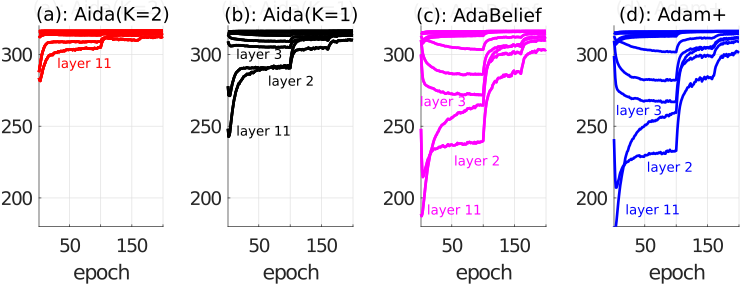

# Aida Optimizer
## 1) Brief description of Aida
Aida optimiser is designed to effectively train DNN models. As an extension of AdaBelief, Aida exploits the layerwise gradient statistics via simple layerwise vector projections per iteration.  One property of Aida is that the histogram of the adaptive stepsizes tends to much more compact (or narrow) than those of AdaBelief and Adam when training a DNN model. See __G. Zhang, K. Niwa, and W. B. Kleijn, "A DNN Optimizer that Improves over AdaBelief by Suppression of the Adaptive Stepsize Range", arXiv:2203.13273v3, March, 2022.__ [[paper link]](https://arxiv.org/abs/2203.13273) 

